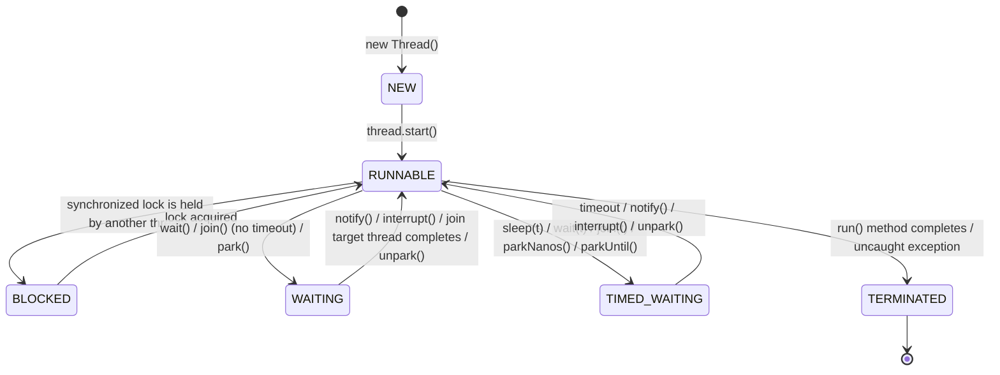

#### 六种状态

NEW：初始状态。线程已被创建，但尚未调用 start() 方法。

RUNNABLE：运行或可运行状态。线程要么在等待 CPU 时间片（就绪），要么已经分配到 CPU 正在执行（运行）。在操作系统层面通常区分 “Ready” 和 “Running”，而 JVM 将二者合并为 RUNNABLE，原因是这两种状态之间切换极快，区分意义不大。

BLOCKED：阻塞状态。线程尝试获取某把锁，但该锁被其他线程持有，需要等待锁释放后才可继续执行。

WAITING：等待状态。线程必须无限期等待其他线程执行特定操作（如通知或中断）才能继续。此状态下的线程无法自动苏醒，需依赖外部通知才能返回 RUNNABLE。

TIMED_WAITING：定时等待状态。线程在指定时间内等待，到时会自动返回 RUNNABLE 状态。与 WAITING 的主要区别在于不需要外部通知就能苏醒。

TERMINATED：终止状态。线程的执行过程已结束，或因未捕获的异常退出。

#### 图示

