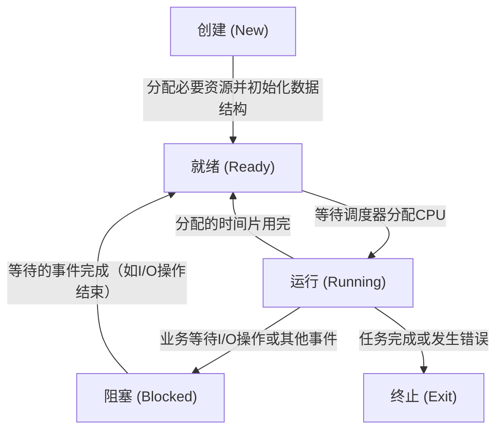

程序是为完成特定任务而编写的一堆代码集合，最初以纯文本文件的形式保存在硬盘上。经过编译后，它会生成可执行文件。当我们运行该程序时，操作系统会将其加载到内存中，以便 CPU 后续执行。这个在内存中正在运行着的程序实例就是一个进程。

#### 为什么要把程序加载到内存中执行？不能在硬盘上直接执行吗？

因为内存的读写速度远快于硬盘（无论是机械硬盘还是固态硬盘）。内存是一种随机存取存储器，其访问延迟通常仅为几十到几百纳秒；相比之下，机械硬盘在访问数据时，通常会经历寻道延迟（即磁头移动到目标磁道）和旋转延迟（即目标数据所在的扇区旋转至磁头下方），这两个过程的延迟加起来通常可达数十毫秒。固态硬盘虽然速度较快，但其访问延迟通常在微秒级，依然远高于内存的纳秒级延迟，通常慢三个数量级以上（即千倍以上）。

CPU 与内存之间通过高速总线直接通信，确保数据能够在极短的时间内完成传输。由于 CPU 的工作频率极高，如果直接从硬盘读取指令，将造成严重的性能瓶颈。假如每次取指延迟达数毫秒，那么每秒最多只能执行几百条指令，而现代 CPU 每秒可执行数十亿条指令，这种差距将极大影响程序的运行效率。因此，只有将程序预先加载到内存中，才能真正发挥 CPU 的高速处理能力。

#### 进程的生命周期

进程的生命周期包括创建、就绪、运行、阻塞、终止等状态。

1. 创建（New）：当一个新进程被创建时，操作系统会为其分配必要的资源（例如内存、文件描述符等），待所有准备工作完成后，该进程便进入就绪状态。

2. 就绪（Ready）：等待 CPU 时间片，随时可以运行。当进程创建完成、分配的时间片耗尽或阻塞等待的事件完成后，就会进入就绪状态。此时，进程已准备好运行，但由于其他程序正在执行，因此需要等待操作系统的进程调度器分配 CPU。通常，处于就绪状态的进程会排队等待，直至被选中执行。将所有处于就绪状态的进程用链表串在一起，就称为就绪队列。

3. 运行（Running）：正在被 CPU 执行。当进程获得 CPU 时间片后，它会进入运行状态，开始执行程序代码。

4. 阻塞（Blocked）：进程在等待某些耗时操作（如 I/O 读写、网络响应、锁）时，会进入阻塞状态，暂时不能运行。在阻塞状态下，进程不会占用 CPU 资源，因为 CPU 不会傻等（空转），而是会去执行其它就绪的进程。一旦等待的操作完成，此时该进程将重新进入就绪队列，等待再次调度执行。把所有因等待某耗时操作而处于等待状态的进程链在一起就组成了阻塞队列。

5. 终止（Exit）：当进程完成所有任务，或因错误发生或外部干预而被强制终止时，它将进入终止状态。此时，操作系统会回收该进程所占用的所有资源。

挂起（Suspend）：是指进程被暂时移出内存，存放到磁盘的交换分区（swap）中，以释放内存资源。

尽管未执行的进程不会占用 CPU，但它们依然占据内存和其它系统资源。当大量此类进程同时驻留内存，会造成内存压力。为优化内存使用，操作系统会将部分进程的数据换出到磁盘，在需要再次运行时再从硬盘加载回内存。此时，进程虽然仍然存在，但不占用实际的物理内存空间，这就是“挂起状态”。

挂起状态又可细分为两种常见情况：

- 阻塞挂起（Blocked Suspend）：进程原本就在等待某个事件（如 I/O 操作），为了进一步节省内存，操作系统将其换出到磁盘。这类进程在磁盘中“卡着”，直到等待的事件完成，再有机会换入内存。

- 就绪挂起（Ready Suspend）：进程已经准备好运行（处于就绪状态），但由于内存不足，暂时被操作系统移出内存。等内存空闲后，再被调度回内存执行。

#### 进程控制块

PCB（Process Control Block，进程控制块）是操作系统用于管理进程的数据结构。当一个进程被创建时，操作系统会为其创建一个对应的 PCB，用于存储该进程的所有关键信息。

PCB 保存了如下信息：
1. 进程标识：如进程 ID（PID）、父进程 ID（PPID）和所属用户 ID
2. 进程运行状态：正在运行、已挂起等状态
3. CPU 上下文：包括寄存器、程序计数器（PC）、栈指针等，用于进程切换
4. IO 信息：如已打开的文件和使用的设备

当操作系统需要将 A 进程切换为 B 进程时，会执行以下步骤：
1. 将 A 进程的 CPU 状态（如寄存器、程序计数器等）保存到它的 PCB 中
2. 从 B 进程的 PCB 中恢复之前保存的状态
3. CPU 开始执行 B 进程的代码
这种切换过程称为进程上下文切换，而 PCB 就是记录每个进程“保存点”的关键所在，是实现多进程调度的基础。

调度器根据 PCB 中的状态、优先级等决定下一个运行的进程。

#### 参考资料

[【操作系统】进程和线程的区别](https://www.bilibili.com/video/BV1Wr4y1P7Yr/)
[5.1 进程、线程基础知识](https://xiaolincoding.com/os/4_process/process_base.html)
